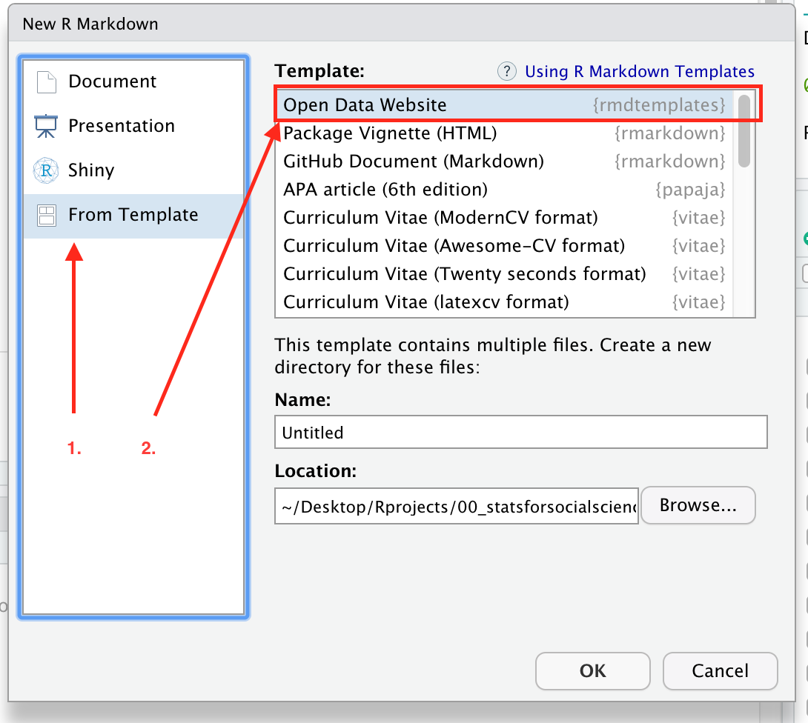

RMD Templates
================

## Content

This package provides a list of RMD Templates to use. The collection is
opinionated.

The templates contained are:

  - Open Data Website based on rmdformats::material
  - LNCS Springer template based on normal pdf output (comes with a list
    of files ready for submission)

# Install instructions

First run the following code:

``` r
if(!require(devtools)){
  install.packages("devtools")
}
devtools::install_github("statisticsforsocialscience/rmd_templates")
library(rmdtemplates)
```

Then restart R or better restart RStudio.

Voilá, you should now have an addition option in your “New -\>
RMarkdown” dialoge


